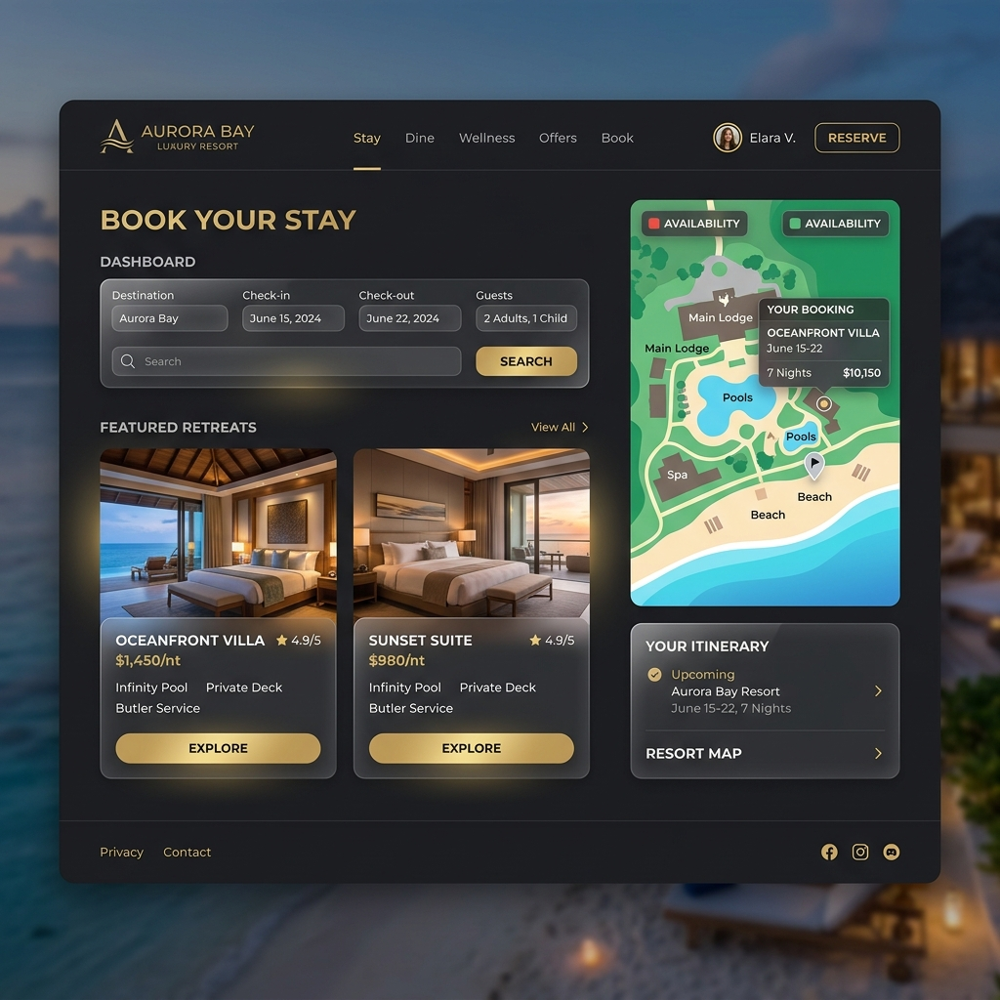

<div align="center">
  

  # 🏖️ Beach Resort
  ### *A Premium Full-Stack Hotel Room Booking & Management System*

  [](https://nextjs.org/)
  [](https://reactjs.org/)
  [](https://nodejs.org/)
  [](https://www.mysql.com/)
  [](https://expressjs.org/)
  [](https://redux.js.org/)
  [](https://ant.design/)
  <br />
  [](https://opensource.org/licenses/MIT)
  [](http://makeapullrequest.com)
  [](https://GitHub.com/Naereen/StrapDown.js/graphs/commit-activity)

  <p align="center">
    <b>Experience luxury in every click. A sophisticated solution for modern hospitality.</b>
    <br />
    <a href="#-key-features">Features</a> •
    <a href="#-getting-started">Getting Started</a> •
    <a href="#-screenshots">Screenshots</a> •
    <a href="#-tech-stack">Tech Stack</a>
  </p>
</div>

---

## 🌟 Introduction

**Beach Resort** is a state-of-the-art, full-stack application designed for high-end resorts and hotels. It offers a seamless experience for guests to browse rooms and make reservations, while providing a powerful administrative interface for managing the entire property.

Built with performance and aesthetics in mind, the system leverages **Next.js 13** for the guest portal and a robust **Node.js/MySQL** backend to ensure scalability and reliability.

---

## ✨ Key Features

### 🏨 Guest Experience (Frontend)
- **Stunning UI/UX**: Modern, responsive design using glassmorphism and premium typography.
- **Advanced Room Filtering**: Filter by type, price, size, and occupancy.
- **Smart Booking Engine**: Real-time availability checks and conflict prevention.
- **UPI Payment Integration**: Manual UPI payment workflow with admin verification.
- **User Profiles**: Manage personal bookings and account settings.
- **Verified Reviews**: Authentic feedback system from real guests.

### ⚙️ Administrative Power (Admin Panel)
- **Live Analytics**: At-a-glance dashboard for revenue and booking stats.
- **Room Management**: Full CRUD operations for room details and images.
- **Booking Oversight**: Approve, reject, or update booking statuses manually.
- **Payment Verification**: Review UPI transaction IDs before confirming orders.
- **User Management**: Monitor and manage registered guests.

---

## 🛠️ Tech Stack

| Layer | Technologies |
| :--- | :--- |
| **Frontend** | Next.js 13, React, Redux Toolkit, Framer Motion |
| **Admin Panel** | React, Ant Design, Tailwind CSS |
| **Backend** | Node.js, Express.js, JWT, Winston Logger |
| **Database** | MySQL (XAMPP / Local Server) |
| **Mailing** | Nodemailer (Brevo/SMTP integration) |

---

## 🚀 Getting Started

### Prerequisites
- [Node.js](https://nodejs.org/) (v18.x or 20.x recommended)
- [MySQL Server](https://www.mysql.com/) (XAMPP is perfect for local dev)

### Quick Setup

1. **Clone the Repo**
   ```bash
   git clone https://github.com/your-username/Beach-Resort-Booking.git
   cd Beach-Resort-Booking
   ```

2. **Backend Initialization**
   ```bash
   cd backend
   npm install
   cp .env.example .env # Configure your DB details
   npm run db:setup     # Automatically creates DB and tables
   npm start
   ```

3. **Guest Portal Setup**
   ```bash
   cd ../frontend
   npm install
   npm run dev
   ```

4. **Admin Panel Setup**
   ```bash
   cd ../admin-panel
   npm install
   npm start
   ```

---

## 📸 Screenshots

<div align="center">
  <p><b>Guest Portal Home</b></p>
  
  <br><br>
  <p><b>Admin Management Dashboard</b></p>
  
</div>

---

## 📁 Project Structure

```text
├── admin-panel/    # React + AntD management interface
├── backend/        # Express API with MySQL
├── frontend/       # Next.js 13 Guest portal
└── SETUP_GUIDE.md  # Detailed setup instructions
```

---

## 🛡️ License

Distributed under the **MIT License**. See `LICENSE` for more information.

---

<p align="center">
  Designed and Developed by <a href="https://github.com/darvex-0">darvex-0</a>
  <br>
  <i>Empowering hospitality through innovation.</i>
</p>
